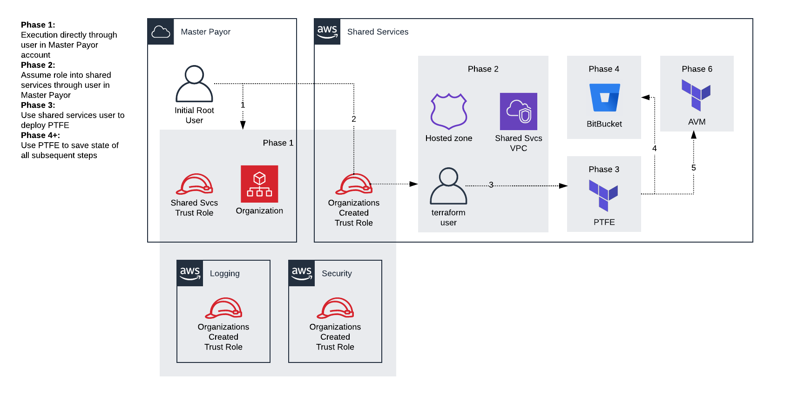

## TLZ Setup

### Prerequisites (manual non-programmatic)

* Private Terraform Enterprise (PTFE) License
* Email addresses to be used for root account IDs (orgMaster, shared-services, logging, security)
* Manage emails in Confluence/centrally managed excel spreadsheet 
* Valid FQDN for shared services namespace
* Matching TLS cert keychain (must be exportable)
* New AWS account
  * [Request submitted to AWS support to raise organization account limit.](https://docs.aws.amazon.com/organizations/latest/userguide/orgs_reference_limits.html)
  * Configure 2FA on root account and place QR code artifact in Watchdox and credentials in LastPass
  * Configure [alternate account contacts for security, billing, and ops](https://docs.aws.amazon.com/awsaccountbilling/latest/aboutv2/manage-account-payment.html#account-contacts)
  * [Confirm your root account email address has been "verified"](https://aws.amazon.com/premiumsupport/knowledge-center/consolidated-billing-linking-error/)
  * [Make sure your account billing status has been confirmed](https://portal.aws.amazon.com/billing/signup?type=resubscribe#/resubscribed)
  * Create IAM programmatic user (recommend 'terraform-svc') to be used for bootstrap module(s)

### Getting started:

1. Create the initial root account with the above information
1. Create programmatic credentials for the account
1. Apply those credentials to an AWS CLI profile. Default name for this is ROOT_DELETE_ME (var.profile)
1. Setup the [terraform.tfvars](terraform.tfvars) file with the appropriate values for root emails and environment (for tags)
1. Apply this repo to the root account. This will perform the following actions:
   * Create TLZ organization
   * Create core-logging account
   * Create core-security account
   * Create core-shared-services account
   * Create role trusting shared services(required for provisioning new accounts by AVM)
   * Create billing alarm for new master payor account. (this may need to be moved to baseline-master-payer)
1. Move on to bootstrap-core-shared-services

Executing this will provision Phase 1 in the below diagram. From there moving on to bootstrap-core-shared-services will deploy Phase 2.

## Inputs

| Name | Description | Type | Default | Required |
|------|-------------|:----:|:-----:|:-----:|
| alarms\_email | Email address to use for billing alarms in the new account | string | n/a | yes |
| currency | Short notation for currency type to use for account billing (e.g. USD, CAD, EUR) | string | `"USD"` | no |
| environment | Environment type this will be deploying(Dev/Prod?) | string | n/a | yes |
| logging\_email | Email for the shared services account | string | n/a | yes |
| logging\_name | Name/Alias of the shared services account | string | `"core-logging"` | no |
| monthly\_billing\_threshold | The threshold for which estimated monthly charges will trigger the metric alarm. | string | `"800"` | no |
| org\_admin\_role | Name of the admin roles establishing the trust between the master payer account and the shared services account | string | `"tlz_organization_account_access_role"` | no |
| profile | AWS CLI profile for terraform to execute with | string | `"ROOT_DELETE_ME"` | no |
| region | Region to use for the AWS provider | string | `"us-west-2"` | no |
| security\_email | Email for the shared services account | string | n/a | yes |
| security\_name | Name/Alias of the shared services account | string | `"core-security"` | no |
| shared\_svcs\_email | Email for the shared services account | string | n/a | yes |
| shared\_svcs\_name | Name/Alias of the shared services account | string | `"core-shared-services"` | no |
| stack | Name of the stack to use in tagging | string | `"TLZ"` | no |
| trust\_shared\_services\_policy | Arn of policy the master payer account will use to trust shared services | string | `"arn:aws:iam::aws:policy/AdministratorAccess"` | no |

## Outputs

| Name | Description |
|------|-------------|
| core\_logging\_account\_id | Account number for the core logging account |
| core\_master\_payer\_account\_id | Account number for the master payer account |
| core\_security\_account\_id | Account number for the core security account |
| core\_shared\_svcs\_account\_id | Account number for the core shared services account |

### Initial planning

1. Run TF module to create shared services org account (stateless?)
2. Configure IAM user in shared-services account (another terraform-svc) -- Maybe done in bootstrapping...
3. Deploy ptfe

   * We’ll need to make sure the shared-services account has a VPC with pub/priv subnets that have tagging that matches the data resources.
   * Manual steps remaining needing automation: Setup user auth (saml, oauth)

4. Deploy bitbucket using ptfe backend

   * Use 'bitbucket' workspace created during ptfe initial Deploy
   * No VCS backing
   * Manual steps: License applied, user account (SAML), create initial repos for TLZ

5. PTFE -> Add VCS provider https://www.terraform.io/docs/providers/tfe/r/oauth_client.html#service_provider

   * https://www.terraform.io/docs/enterprise/vcs/bitbucket-server.html

6. Import modules into repos created in 4.
7. Create workspaces

   * AVM
   * Account request format
   * Security account baseline
